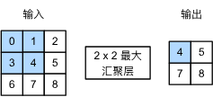

# Lenet

## 卷积

互相关运算。  
例如：  
$$
\begin{bmatrix}1
  &2  &3 \\4
  &5  &6 \\7    
  &8  &9
\end{bmatrix} \ast \begin{bmatrix}1
  &2 \\3
  &4
\end{bmatrix} = \begin{bmatrix}1 + 5+12+20
  &2+6+15+24 \\4+10+21+43
  &5+12+24+36
\end{bmatrix}
$$

对应位置相乘。  
在卷积层中要训练的参数是权重 w 和偏置 b。  
```python
corr2d(x, self.weight) + self.bias
```

## 边缘检测

```python
tensor([[1., 1., 0., 0., 0., 0., 1., 1.],
        [1., 1., 0., 0., 0., 0., 1., 1.],
        [1., 1., 0., 0., 0., 0., 1., 1.],
        [1., 1., 0., 0., 0., 0., 1., 1.],
        [1., 1., 0., 0., 0., 0., 1., 1.],
        [1., 1., 0., 0., 0., 0., 1., 1.]])
```
内部与外部的不同之处是内部为0，外部为1，所以使用一个卷积核对它进行卷积时得出结构不同，以此可以分辨边缘。  

输出的卷积层有时被称为特征映射（feature map），因为它可以被视为一个输入映射到下一层的空间维度的转换器。  
对于某一层的任意元素 $x$ ，其感受野（receptive field）是指在前向传播期间可能影响
计算的所有元素（来自所有先前层）。  

## 多通道

卷积，合并通道。  
  
汇聚层会保持通道数不变。  

## 汇聚层

降低卷积层对位置的敏感性，同时降低对空间降采样表示的敏感性。  
最大汇聚层。  



## lenet 背景
自然数据（不论是语音、符号还是其他模式）的多变性和丰富性使得完全通过手动来建立一个准确的识别系统是几乎不可能的。因此，大多数模型识别系统的建立是通过将自动学习方法（可训练的分类器）与手动设计算法（特征提取器）相结合（如Fig.1）。  
1.具有快速运算单元的低成本机器允许依赖更多的蛮力“数值”方法，而不是算法的改进；  
2.对如手写识别等问题的大量数据的出现使得设计者能更多地依赖真实数据而非手动提取的特征来建立识别系统；  
3.（关键）当使用这些大量的数据集训练时，能处理高维输入的强大的机器学习算法可以生成复杂的决策函数。

## 结构


前面进行卷积，后面使用两个全连接层。

使用交叉熵损失函数和随机梯度下降。

```python
class net(torch.nn.Module):
    def __init__(self):
        super(net, self).__init__()
        self.nn_1 = torch.nn.Sequential(
            torch.nn.Conv2d(in_channels=1, out_channels=6, kernel_size=5, stride=1, padding=2),
            torch.nn.Sigmoid(),
            torch.nn.AvgPool2d(kernel_size=2, stride=2),
            torch.nn.Conv2d(in_channels=6, out_channels=16,kernel_size=5, padding=1),
            torch.nn.Sigmoid(),
            torch.nn.AvgPool2d(kernel_size=2, padding=1),
        )
        self.nn_2 = torch.nn.Sequential(
            torch.nn.Flatten(),
            torch.nn.Linear(16*7*7, 120),
            torch.nn.Sigmoid(),
            torch.nn.Linear(120, 10)
        )

    def forward(self, x):
        x = self.nn_1(x)
        x = self.nn_2(x)
        return x
```

## 数据


## 结果


准确度：


