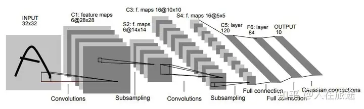

# lenet 和 Alexnet

---
# lenet

Gradient-based learning applied to document recognition


---

## 背景

自然数据（不论是语音、符号还是其他模式）的多变性和丰富性使得完全通过手动来建立一个准确的识别系统是几乎不可能的。因此，大多数模型识别系统的建立是通过将自动学习方法（可训练的分类器）与手动设计算法（特征提取器）相结合（如Fig.1）。  
1.具有快速运算单元的低成本机器允许依赖更多的蛮力“数值”方法，而不是算法的改进；  
2.对如手写识别等问题的大量数据的出现使得设计者能更多地依赖真实数据而非手动提取的特征来建立识别系统；  
3.（关键）当使用这些大量的数据集训练时，能处理高维输入的强大的机器学习算法可以生成复杂的决策函数。

---

## 结构



结构主要为前半部分的卷积和后半部分的全连接层，使用 sigmoid 激活函数。  

---

## 结构


有一个特征提取器模块和一个分类器模块。  
在前面的卷积层提取图片的特征，再在最后进行分类。  

---

## 方法

- 从数据中学习
- 基于梯度的学习
使用 随机梯度下降。
- 梯度反向传播
- 在真实手写识别系统中学习
- 全局训练系统

---

## 实现

```python
class net(torch.nn.Module):
    def __init__(self):
        super(net, self).__init__()
        self.nn_1 = torch.nn.Sequential(
            torch.nn.Conv2d(in_channels=1, out_channels=6, kernel_size=5, stride=1, padding=2),
            torch.nn.Sigmoid(),
            torch.nn.AvgPool2d(kernel_size=2, stride=2),
            torch.nn.Conv2d(in_channels=6, out_channels=16,kernel_size=5, padding=1),
            torch.nn.Sigmoid(),
            torch.nn.AvgPool2d(kernel_size=2, padding=1),
        )
        self.nn_2 = torch.nn.Sequential(
            torch.nn.Flatten(),
            torch.nn.Linear(16*7*7, 120),
            torch.nn.Sigmoid(),
            torch.nn.Linear(120, 10)
        )

    def forward(self, x):
        x = self.nn_1(x)
        x = self.nn_2(x)
        return x
```

---

## 结果


lenet 与其他方法比错误率低。

---

## 结果


随着训练次数增加，准确率提升。

---

## 结论

卷积神经网络已被证明可以消除手工制作的特征提取器的需要。随着训练数据变得丰富，随着计算机变得越来越快，随着我们对学习算法理解的提高，识别系统将越来越依赖学习，其性能也会提高。  

---

# Alexnet

---

## 背景

因为现实环境中的物体表现出相当大的可变性, 使用小的数据集训练模型有一定的限制,所以需要使用更大的训练集来训练模型。  
当今硬件提升推动可以将大的卷积神经网络用于高分辨率图像的分类 

---

## 结构


Alexnet 相比于 lenet 层数更多，激活函数选择了 relu 函数。（训练更快，效果更好）

---

## 方法

- 在多个 GPU 上进行训练
  将模型切开进行训练
- 防止过拟合（dropout）
  暂退法
- 使用随机梯度下降进行训练
- 使用 relu 激活函数
  训练效果更好

---

## 实现

```python
class Net(torch.nn.Module):
    def __init__(self) -> None:
        super(Net, self).__init__()
        self.net = torch.nn.Sequential(
            torch.nn.Conv2d(in_channels=1, out_channels=96, kernel_size=11, stride=4, padding=5),
            torch.nn.ReLU(),
            torch.nn.MaxPool2d(kernel_size=3, stride=2),
            torch.nn.Conv2d(in_channels=96, out_channels=256, kernel_size=5, stride=1, padding=2),
            torch.nn.ReLU(),
            torch.nn.MaxPool2d(kernel_size=3, stride=1),
            torch.nn.Conv2d(in_channels=256, out_channels=384, kernel_size=3, stride=1, padding=1),
            torch.nn.ReLU(),
            torch.nn.Conv2d(in_channels=384, out_channels=384, kernel_size=3, stride=1, padding=1),
            torch.nn.ReLU(),
            torch.nn.Conv2d(in_channels=384, out_channels=256, kernel_size=3, stride=1, padding=1),
            torch.nn.ReLU(),
            torch.nn.MaxPool2d(kernel_size=3, stride=2),
            torch.nn.Flatten(),
            torch.nn.Linear(4096, 4096),
            torch.nn.Linear(4096, 1000),
            torch.nn.Linear(1000, 10),
        )

    def forward(self, x):
        return self.net(x)
```
---

## 结果


分别在 ILSVRC-2010 和 ILSVRC-2012 上进行测试，错误率都比较低。  

---

## 结果


---

## 结论

大型深度卷积神经网络能够使用纯监督学习在极具挑战性的数据集上取得破纪录的结果，并且研究者希望在视频序列上使用非常大和深的卷积网络。

