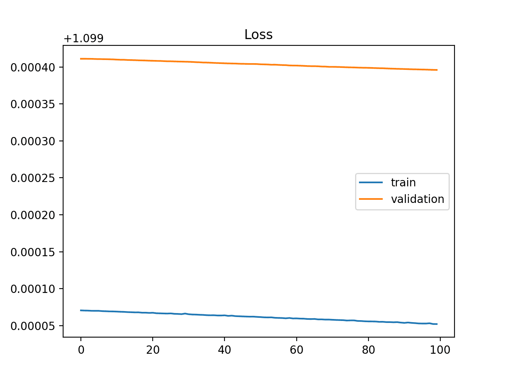
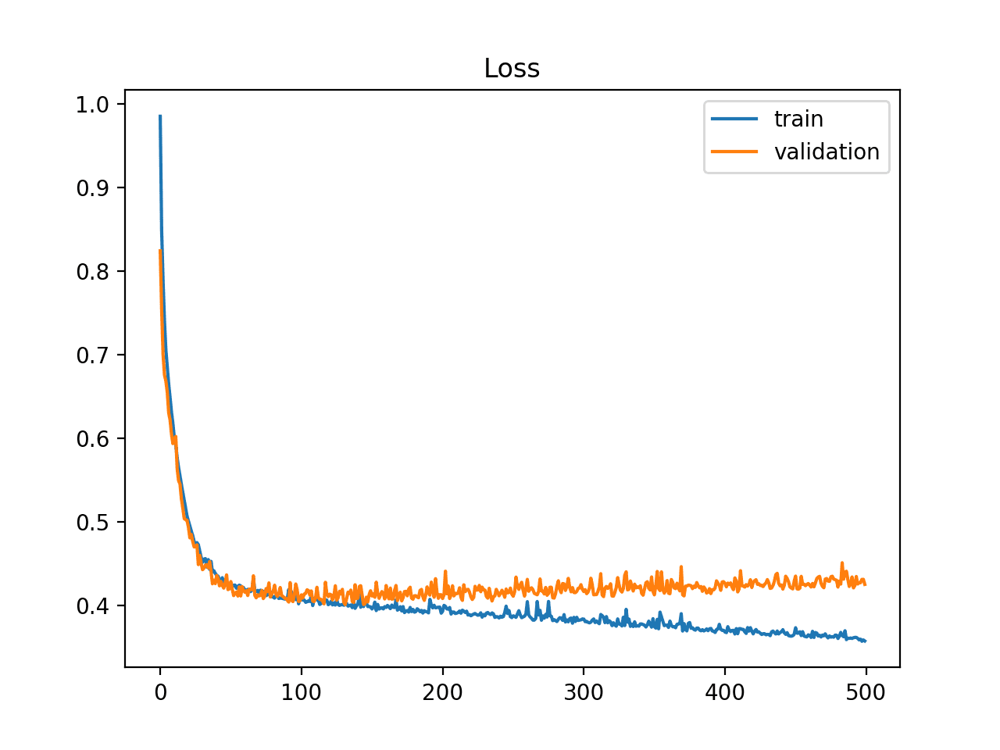
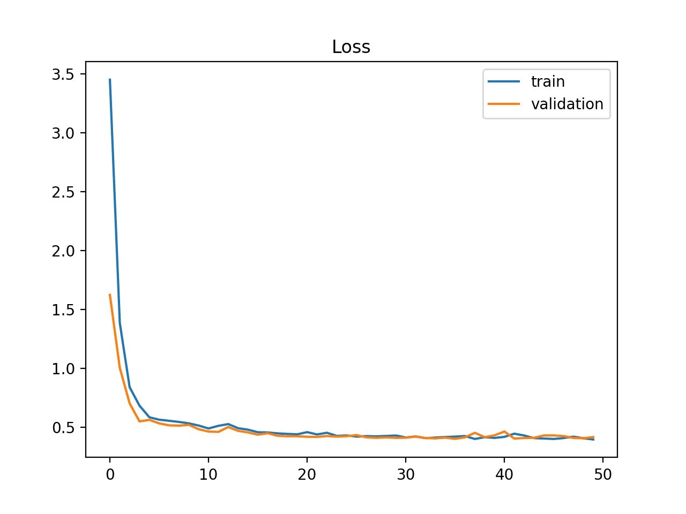

# Loss 曲线分析

## Underfit

在训练结束时候training loss还在继续下降。  

## Overfit

overffit时候training loss一直在不断地下降，而validation loss在某个点开始不再下降反而开始上升了。  

## Good fit

training loss和validation loss都已经收敛并且之间相差很小很小.

